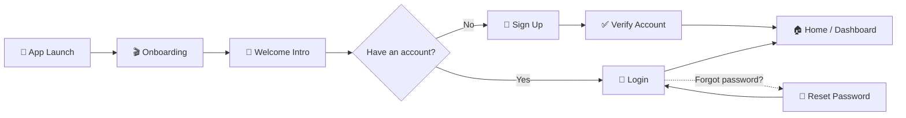

<div align="center">

# 📚✨ TechTutor

### *Learn anywhere. Learn anytime. Learn your way.*


<br/>


</div>

<br/>

<p align="center">
  <em>TechTutor is a sleek, cross-platform mobile learning companion built with Expo &amp; React Native.
  Smooth onboarding, secure authentication, and a foundation ready for courses, videos, and certificates —
  all wrapped in a clean, modern UI.</em>
</p>
<p align="center">
  <sub>📸 Swap these placeholders for real app screenshots or a GIF walkthrough!</sub>
  </p>
</div>

---

## 📑 Table of Contents

- [✨ Features](#-features)
- [🛠️ Tech Stack](#️-tech-stack)
- [📂 Project Structure](#-project-structure)
- [🚀 Getting Started](#-getting-started)
- [⚙️ Environment Variables](#️-environment-variables)
- [📱 Running on Devices](#-running-on-devices)
- [🧭 App Flow](#-app-flow)
- [🗺️ Roadmap](#️-roadmap)
- [🤝 Contributing](#-contributing)
- [📄 License](#-license)

---

## ✨ Features

| | |
|---|---|
| 🎬 **Animated Onboarding** | Eye-catching swiper-based intro that welcomes new learners |
| 🔐 **Full Auth Flow** | Sign up, login, forgot password & account verification screens |
| 🔔 **Toast Notifications** | Instant, non-intrusive feedback powered by `react-native-toast-notifications` |
| 🎨 **Custom Design System** | Reusable styled `Button`, gradients, and responsive typography |
| 📱 **Fully Responsive** | Built with `react-native-responsive-screen` / `-dimensions` for pixel-perfect layouts on any device |
| 🧭 **File-based Navigation** | Powered by `expo-router` for clean, scalable routing |
| 🌐 **API Ready** | Axios pre-wired to a configurable backend (`SERVER_URI`) |
| ⚡ **TypeScript First** | Type-safe components and data models throughout |

---

## 🛠️ Tech Stack

<div align="center">

| Category | Technology |
|---|---|
| **Framework** | Expo `~51.0.21` · React Native `0.74.3` |
| **Language** | TypeScript `5.3` |
| **Navigation** | Expo Router · React Navigation (Native Stack & Bottom Tabs) |
| **Networking** | Axios |
| **Storage** | AsyncStorage |
| **UI / Styling** | Expo Linear Gradient · Expo Vector Icons · Nunito & Raleway Google Fonts |
| **Animations** | React Native Reanimated |
| **Notifications** | React Native Toast Notifications |
| **Onboarding** | React Native App Intro Slider |

</div>

---

## 📂 Project Structure

```text
TechTutor_APP/
├── app/                        # Expo Router entry points (file-based routing)
│   ├── _layout.tsx             # Root layout & font/splash-screen handling
│   ├── index.tsx                # App entry → redirects to onboarding
│   └── (routes)/
│       ├── onboarding/          # Onboarding flow
│       ├── Welcome_Intro/       # Welcome / intro screen
│       ├── login/               # Login screen
│       ├── sign-up/             # Sign-up screen (wrapped in ToastProvider)
│       ├── forgot-password/     # Password recovery screen
│       └── verifyAccount/       # Account verification screen
├── Screens/                     # Actual screen implementations
├── components/                  # Reusable UI components (e.g. Button)
├── styles/                      # Shared & screen-specific stylesheets
├── constants/                   # Static data & color palettes
├── Utils/                       # Utility helpers (e.g. server URI config)
├── types/                       # Global TypeScript type declarations
├── app.json                     # Expo app configuration
├── babel.config.js
└── tsconfig.json
```

---

## 🚀 Getting Started

### ✅ Prerequisites

- [Node.js](https://nodejs.org/) `>= 18`
- [npm](https://www.npmjs.com/) or [yarn](https://yarnpkg.com/)
- [Expo CLI](https://docs.expo.dev/get-started/installation/) (installed automatically via `npx`)
- **Expo Go** app on your phone, or an iOS/Android simulator

### 📦 Installation

```bash
# 1. Clone the repository
git clone https://github.com/<your-username>/TechTutor_APP.git
cd TechTutor_APP

# 2. Install dependencies
npm install

# 3. Start the development server
npm start
```

---

## ⚙️ Environment Variables

TechTutor talks to a backend API via the `SERVER_URI` variable. Create a `.env` file in the project root:

```env
SERVER_URI=http://<your-local-ip>:8000/api/v1
```

> 💡 **Tip:** If no `.env` is provided, the app defaults to `http://192.168.1.4:8000/api/v1` — be sure to update this to match your backend server's IP address.

---

## 📱 Running on Devices

| Platform | Command |
|---|---|
| 🤖 Android | `npm run android` |
| 🍎 iOS | `npm run ios` |
| 🌐 Web | `npm run web` |
| 🧪 Tests | `npm test` |

Scan the QR code from the terminal with the **Expo Go** app to preview instantly on your physical device.

---

## 🧭 App Flow



---

## 🗺️ Roadmap

- [x] Onboarding & welcome experience
- [x] Authentication screens (login, sign-up, forgot password, verify)
- [ ] Home dashboard & course catalog
- [ ] Video lesson player
- [ ] Progress tracking & certificates
- [ ] Push notifications
- [ ] Dark mode 🌙

---

## 🤝 Contributing

Contributions, issues, and feature requests are welcome!

1. Fork the project
2. Create your feature branch (`git checkout -b feature/amazing-feature`)
3. Commit your changes (`git commit -m 'Add some amazing feature'`)
4. Push to the branch (`git push origin feature/amazing-feature`)
5. Open a Pull Request

---

## 📄 License

This project is licensed under the **MIT License** — feel free to use, modify, and share.

---

<div align="center">

Made with ❤️ and ☕ for lifelong learners everywhere.

⭐ **If you like this project, consider giving it a star!** ⭐

</div>
